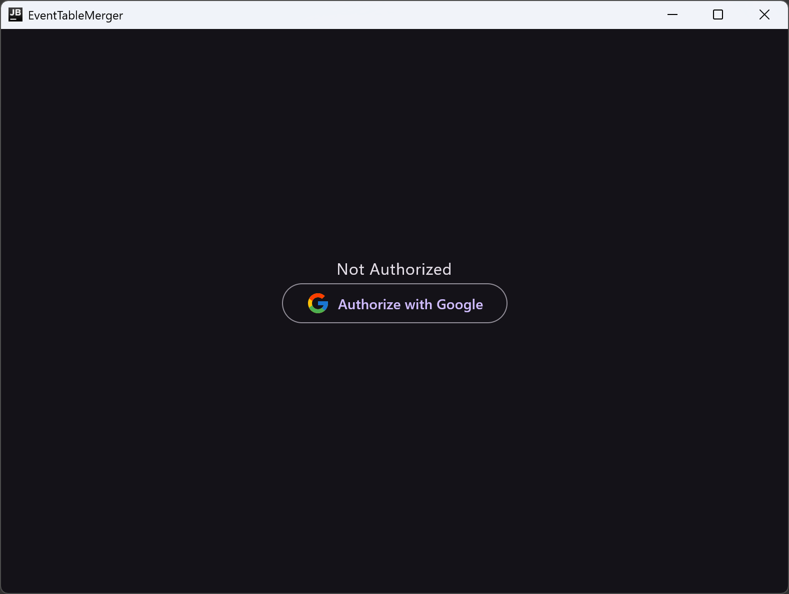
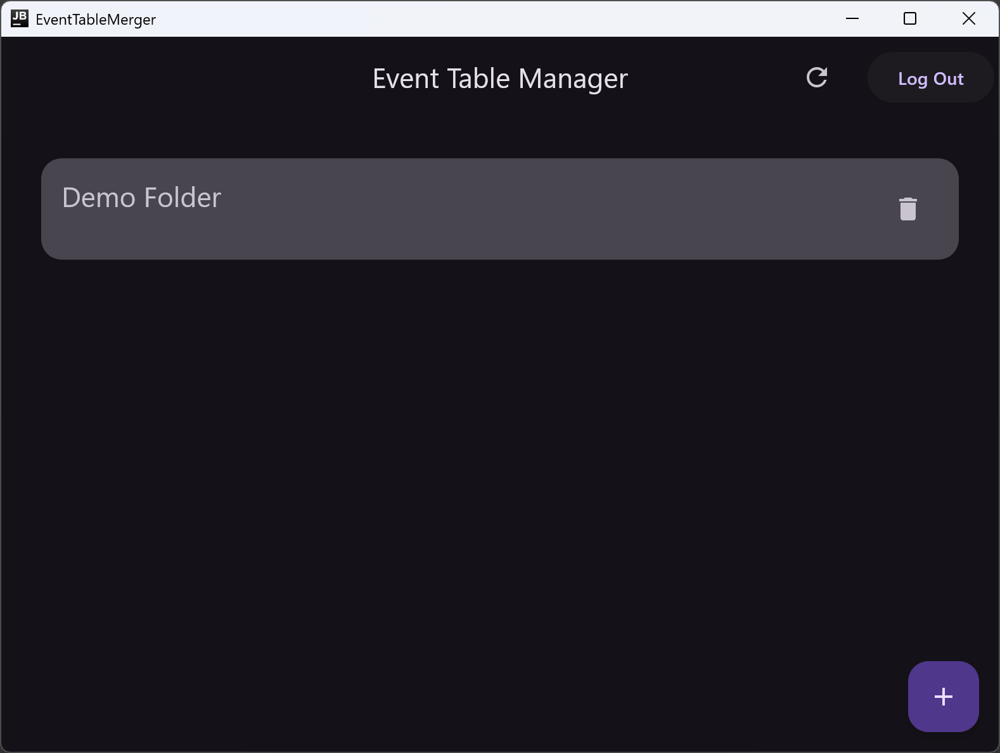
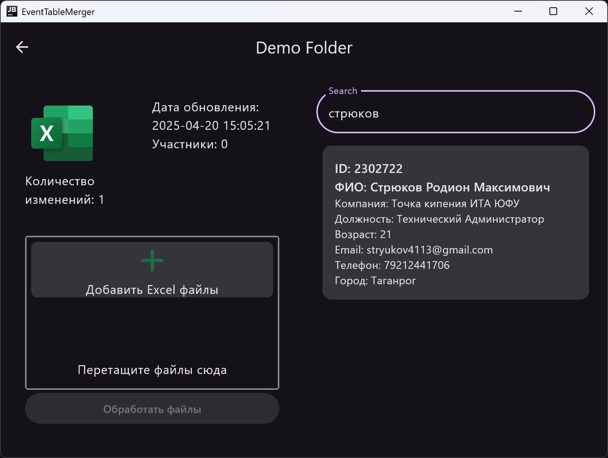

## EventTableMerger
Это приложение, созданное с использованием Kotlin Multiplatform (KMP), для работы
на настольных компьютерах. Оно интегрируется с Google Drive и работает с Excel таблицами.

## Скриншоты

